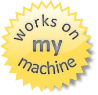

OMeta/ObjC
===

Chris Eidhof  
Berlin Cocoaheads  
Nov 21 2012

!

Problem: constrained to one language
===

!

Can be verbose to express some things
===

    NSFetchRequest* f = [NSFetchRequest 
      fetchRequestWithEntityName:@"User"];
    f.predicate = [NSPredicate predicateWithFormat:
      @"name = %@", @"chris"]
    f.sortDescriptors = 
      @[[NSSortDescriptor sortDescriptorWithKey:@"birthDate"
                                      ascending:NO]];
    return [self.managedObjectContext 
             executeFetchRequest:f
                           error:NULL];

!

SQL
===

    SELECT * from users 
      where name = 'chris' 
      order by birthDate asc;

!

Example: constraints
===

     [NSLayoutConstraint 
         constraintWithItem:button1
                  attribute:NSLayoutAttributeRight
                  relatedBy:NSLayoutRelationEqual
                     toItem:button2
                  attribute:NSLayoutAttributeLeft
                 multiplier:1.0
                   constant:-12.0];

!

ASCII-Art
===

     [button1]-[button2]

!

Solution: DSLs
===

  * Domain Specific Language
  * Special-Purpose
  * Three types
     * Standalone 
     * Embedded 
     * Runtime

!

Example DSLs
===

  * SQL
  * View builder (e.g. Haml)
  * Testing (e.g. Cucumber/Gherkin)
  * Extending ObjC
  * View finder API (like XPath)
  * ASCII-Art Constraints
  * LINQ
  * State machines
  * Calculator
  * JSON Parsing
  * Smalltalk
 
!

How do you build this?
===

  * Standalone DSL:
    * Lexer
    * Parser
    * Code Generator

!

Embedded DSL
===
  * Plain Cocoa
  * Problem: things have long names
  * Can be a lot of work and feel weird

!

Runtime DSL
===

  * ?

!

Solution: Ometa
===

YEAH

!

History
===

  * STEPS/Fonc
  * Smalltalk/JS
  * Alex Warth
  * Alan Kay

!

Gotchas
===

  * Work in Progress
  * No decent integration yet
  * Not optimized
  * But: lots of tests

!

Example: Calculator
===

    ometa ExpRecognizer {
       num = digit+,
       fac = num '*' fac 
           | num '/' fac 
           | num, 
       exp = fac '+' exp 
           | fac '-' exp, 
    }

!

Compiling the OMeta program
===

  Gives us an `.m` file with the following methods

    - (CEResultAndStream*)num:(id)stream { ... }
    - (CEResultAndStream*)fac:(id)stream { ... }
    - (CEResultAndStream*)exp:(id)stream { ... }

!

Calculating Expressions
===

!

ExpCalculator.m 
===

    ometa E {
    num = digit+:ds      -> 
      [[ds join] integerValue],
    fac = num:x '*' fac:y   -> x * y
        | num:x '/' fac:y   -> x / y
        | num,
    exp = fac:x '+' exp:y   -> x + y
        | fac:x '-' exp:y   -> x - y
        | fac
    }

(We are cheating here)

!

Using ExpCalculator
===

    E* calc = [[E alloc] init];
    int i = [calc exp:@"10*3+7"].result;

!

Adding State
===

    ometa Calc {
      - (void)setup { 
         self.vars = [NSMutableDictionary dictionary]; 
      }
      num = digit+ : ds -> [[ds join] integerValue]
      var = letter
      prim = var:x -> [self.vars[x] intValue]
           | num:n -> n
           | '(' addExp:x ')' -> x
      mulExp = prim:x   '*' mulExp:y -> x * y
             | prim:x   '/' mulExp:y -> x / y
      addExp = mulExp:x '+' exp:y    -> x + y
             | mulExp:x '-' exp:y    -> x - y
             | mulExp,
      exp = var:x '=' exp:r -> vars[x] = @(r)
          | addExp
    }
   

!

Running it
===

     Calc* calc = [[Calc alloc] init];
     [calc exp:@"x=10+10"];
     [calc exp:@"x=x*x"];
     NSInteger i = [calc exp:@"x+5"].result;
     STAssertEqual(i,405, @"Should calculate");
!

Example: Query Parser (`SELECT`)
===

	
    selectQuery = "SELECT * FROM " identifier:entityName 
                                  whereClause:where 
                                  orderClause:order ->
    ^{
     NSFetchRequest* f = [NSFetchRequest 
       fetchRequestWithEntityName:entityName];
     f.predicate = where;
     f.sortDescriptors = order;
     return [self.managedObjectContext 
        executeFetchRequest:f 
        error:NULL];
    }()
!

Example: Query Parser (`WHERE`)
===

    whereClause = "WHERE " boolExpr:e -> e
                | empty,
    boolExpr = identifier:field '=' literal:r -> 
      ^{
        NSString* formatString = 
          [field stringByAppendingString:@" = %@"];
        return [NSPredicate 
          predicateWithFormat:formatString, r];
      }();

!

Example Query Parser (`ORDER`)
===

    orderClause = "ORDER BY " sortDescriptor:i 
                   -> @[i]
                | empty,
    sortDescriptor = identifier:l ordering:o -> 
      [NSSortDescriptor 
        sortDescriptorWithKey:l 
                    ascending:[o boolValue]],
    ordering = "ASC"  -> @YES
             | "DESC" -> @NO
             | empty  -> @YES
   
!

Query Parser: (Usage)
===

From this

    NSString* q = @"select * from User"
                  @"where name='foo'"
                  @"order by birthDate DESC";
    NSArray* result = [query query:q].result;
    
Into this

    NSFetchRequest* f = [NSFetchRequest 
      fetchRequestWithEntityName:@"User"];
    f.predicate = [NSPredicate 
      predicateWithFormat:@"name = %@", @"foo"]
    f.sortDescriptors = @[
       [NSSortDescriptor 
           sortDescriptorWithKey:@"birthDate" 
                       ascending:NO]];
    return [self.managedObjectContext 
       executeFetchRequest:f error:NULL];

!

Limitation: Scalars
===

  Everything needs to be an object, so
 
      mulExp = prim:x '*' mulExp:y -> 
        x * y
  
  Currently reads
     
      mulExp = prim:x '*' mulExp:y -> 
        @([x intValue] * [y intValue])

!

Limitation: ObjC expressions
===

  Can't parse ObjC yet, so
 
      mulExp = prim:x '*' mulExp:y -> 
        @([x intValue] * [y intValue])
  
  Currently reads
     
      mulExp = prim:x '*' mulExp:y -> 
        {{{@([x intValue] * [y intValue])}}}

!

Discussion
===

  * Awesome for prototyping
  * Usage?
  * Ideas: view builder
  * Work in Progress: lots of TODOs

!

Get in touch!
===

  * [github.com/chriseidhof/ometa-objc](https://github.com/chriseidhof/ometa-objc)
  * chris@eidhof.nl
  * [twitter.com/chriseidhof](http://twitter.com/chriseidhof)
